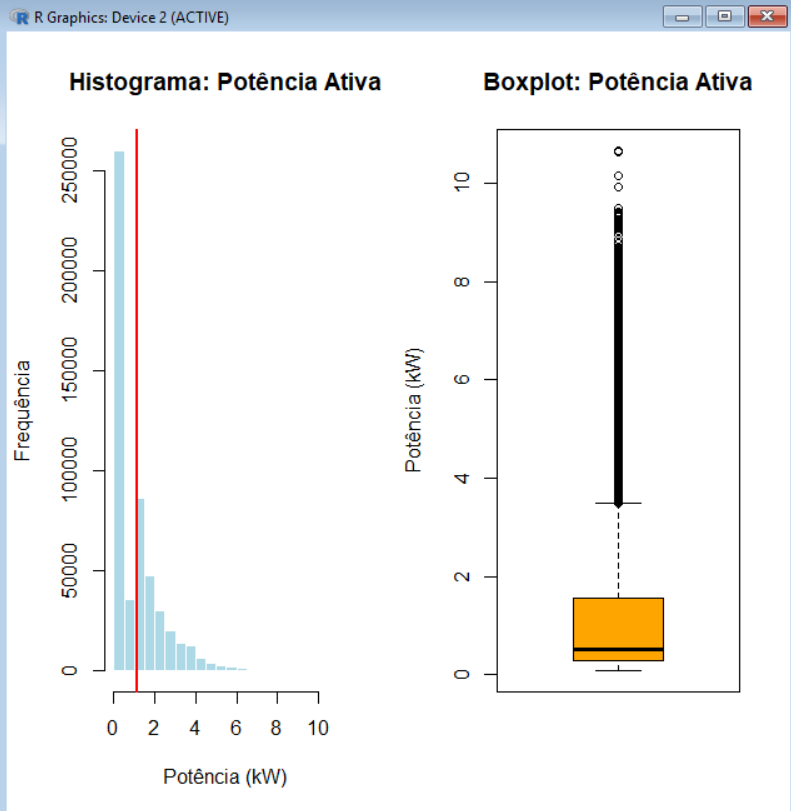
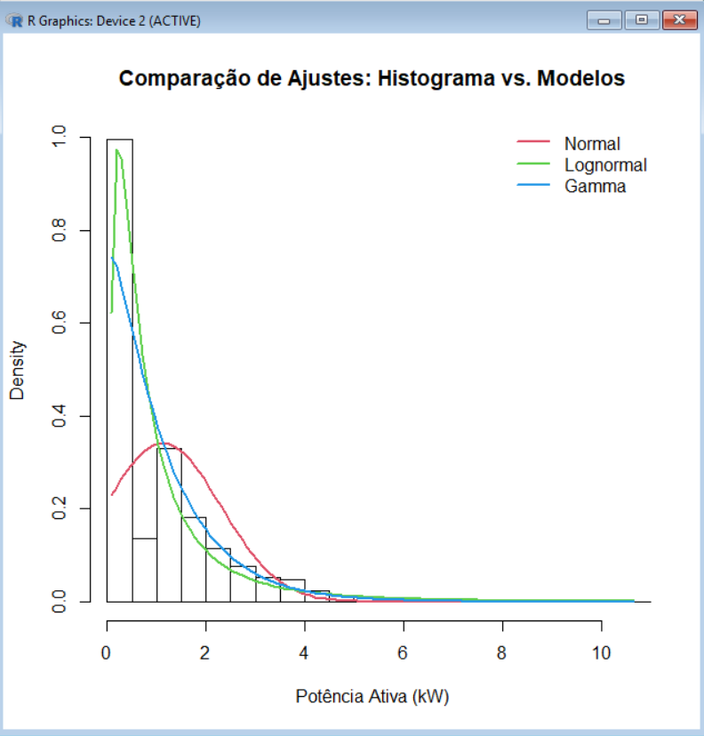

# Analise estatistica do consumo residencial de energia

Repositorio reproduzivel em R para analisar o perfil de consumo de energia
eletrica de uma residencia usando o dataset
"Individual household electric power consumption", do UCI Machine Learning
Repository.


## Resumo

O estudo investiga medicoes minuto a minuto de energia residencial. A analise
inclui estatistica descritiva, intervalos de confianca, testes de hipotese,
comparacao entre dias uteis e fins de semana, ajuste de distribuicoes
probabilisticas e calculo da probabilidade de exceder 2 kW de potencia ativa.

## Motivacao

Dados de consumo eletrico ajudam a entender padroes de demanda, variabilidade,
picos de carga e possiveis implicacoes para dimensionamento eletrico,
gerenciamento de demanda e redes inteligentes.

## Perguntas de pesquisa

- Qual e o comportamento central e a variabilidade da potencia ativa global?
- Quais setores medidos concentram maior consumo acumulado?
- O consumo medio difere de uma referencia de 1,10 kW?
- Ha diferenca entre dias uteis e fins de semana?
- Qual distribuicao probabilistica representa melhor a potencia ativa?
- Qual e a probabilidade de a potencia ativa ultrapassar 2 kW?

## Fonte dos dados

Dataset: "Individual household electric power consumption"  
Fonte: UCI Machine Learning Repository  
URL: <https://archive.ics.uci.edu/dataset/235/individual+household+electric+power+consumption>

O arquivo bruto esperado e:

```text
data/raw/household_power_consumption.txt
```

O dataset completo nao esta incluido no Git. Baixe o arquivo na fonte oficial,
descompacte-o e coloque `household_power_consumption.txt` em `data/raw/`.

## Metodos utilizados

- Preparacao de dados com recorte temporal de 16/12/2006 17:24:00 a
  16/12/2007 17:24:00.
- Conversao de data e hora para `DateTime`.
- Remocao transparente de valores ausentes nas variaveis principais.
- Estatistica descritiva para potencia, tensao, corrente e submedicoes.
- Intervalo de confianca de 95% para a media da potencia ativa.
- Teste t bilateral contra 1,10 kW.
- Teste t de Welch entre dias uteis e fins de semana.
- Comparacao complementar com medias diarias.
- Ajuste por maxima verossimilhanca das distribuicoes Normal, Lognormal e Gamma.
- Comparacao por log-verossimilhanca, AIC e BIC.

## Principais resultados do trabalho original

O PDF original relata que a potencia ativa global apresenta forte assimetria
positiva, alta variabilidade e muitos picos de consumo. O setor de
climatizacao/aquecimento aparece como o maior componente das submedicoes
monitoradas. O trabalho tambem aponta maior consumo medio aos fins de semana
e seleciona a distribuicao Lognormal como a melhor entre Normal, Lognormal e
Gamma.

Os valores numericos deste repositorio sao calculados dinamicamente quando o
dataset esta disponivel. Consulte os CSVs gerados em `outputs/tables/`.

## Graficos originais

As imagens exportadas no trabalho original foram preservadas em
`images/graficos-originais/`.





Novos graficos, gerados diretamente por R/ggplot2, serao salvos em
`outputs/figures/`.

## Estrutura do repositorio

```text
analise-consumo-energia/
├── README.md
├── LICENSE
├── CITATION.cff
├── .gitignore
├── analise-consumo-energia.Rproj
├── data/
│   ├── raw/
│   └── processed/
├── R/
├── scripts/
├── analysis/
├── docs/
├── images/
├── outputs/
└── tests/
```

## Como executar

Instale os pacotes necessarios:

```r
install.packages(c(
  "here",
  "data.table",
  "dplyr",
  "tidyr",
  "lubridate",
  "ggplot2",
  "fitdistrplus",
  "testthat"
))
```

Para renderizar `analysis/relatorio.qmd`, instale tambem o Quarto CLI:
<https://quarto.org/docs/get-started/>.

Prepare os dados:

```r
source("scripts/preparar_dados.R")
```

Execute as analises:

```r
source("scripts/executar_analise.R")
```

Gere o relatorio Quarto:

```bash
quarto render analysis/relatorio.qmd
```

## Competencias demonstradas

- Organizacao de projeto analitico em R.
- Limpeza e validacao de dados.
- Estatistica descritiva e inferencial.
- Modelagem probabilistica por maxima verossimilhanca.
- Visualizacao com `ggplot2`.
- Reprodutibilidade e documentacao tecnica.

## Limitacoes

As principais limitacoes estao documentadas em
[`docs/limitacoes.md`](docs/limitacoes.md). Em resumo, os dados representam uma
unica residencia, um periodo historico especifico e medicoes temporalmente
dependentes.

## Autores

- Eduardo Augusto Rech Alberge
- Willian Matheus Roik

## Licenca

O codigo deste repositorio esta sob licenca MIT. O dataset pertence a sua fonte
original e deve ser obtido diretamente no UCI Machine Learning Repository.

## Como citar

Use os metadados em [`CITATION.cff`](CITATION.cff) ou cite:

Alberge, E. A. R.; Roik, W. M. Analise estatistica aplicada ao perfil de
consumo de energia residencial. 2025.
